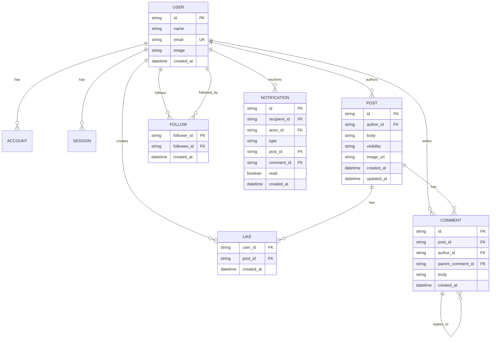

# Database & ERD

The MVP uses a relational database for application data: Cloudflare D1 (SQLite) accessed through Drizzle ORM.

The schema is defined in `src/lib/server/db/schema/` (`auth.ts` for Better Auth's core tables, `sns.ts` for application tables) and the initial migration lives in `src/lib/server/db/migrations/`. Run `pnpm run db:generate` after schema changes, then `pnpm run db:migrate:local` (or `:remote`) to apply.

The `notification` table described below is planned for Phase 5 and is not yet part of the schema.

## Core entities

- **user** — Better Auth user identity and profile basics.
- **account** — Better Auth OAuth/provider account linkage.
- **session** — Better Auth persistent sessions when database session storage is selected.
- **post** — text content, author, visibility, timestamps, and optional image URL.
- **like** — one user-to-post like; unique per user/post pair.
- **comment** — a post comment or one-level reply; replies use `parent_comment_id`.
- **follow** — directed follower → followee relationship; unique pair and no self-follow.
- **notification** — in-app notification for likes, comments, and follows.

## ERD

## Constraints

- `post.visibility` is `public` or `followers-only`.
- A `like` is unique on (`user_id`, `post_id`).
- A `follow` is unique on (`follower_id`, `followee_id`) and cannot have identical follower/followee IDs.
- A reply must reference a comment on the same post.
- Only one reply level is allowed.
- Deleting a post cascades to its likes and comments at the database level.
- Comments/replies inherit the visibility of their parent post.
- Better Auth's generated core tables remain authoritative for auth-specific fields; app-specific profile fields should not duplicate auth data without a reason.

## Migration plan

Phase 1 creates the core schema and migrations before feature work. Better Auth's schema should be generated/configured for the chosen database/ORM, then application tables should be added through the same migration workflow.

If the database or auth storage architecture changes, update this document and [tech-stack.md](./tech-stack.md) in the same PR.
