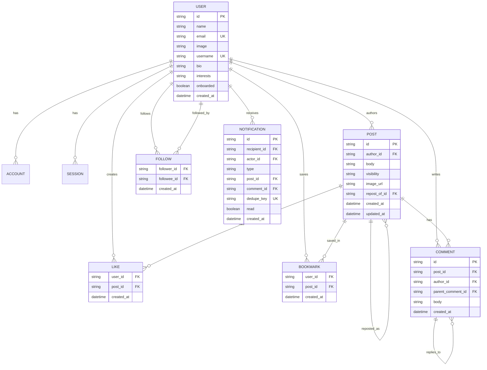

# Database & ERD

The MVP uses a relational database for application data: Cloudflare D1 (SQLite) accessed through Drizzle ORM.

The schema is defined in `src/lib/server/db/schema/` (`auth.ts` for Better Auth's core tables, `sns.ts` for application tables) and the initial migration lives in `src/lib/server/db/migrations/`. Run `pnpm run db:generate` after schema changes, then `pnpm run db:migrate:local` (or `:remote`) to apply.

The `notification` table and `user.username` were added in migration `0001`.

## Core entities

- **user** — Better Auth user identity and profile basics.
- **account** — Better Auth OAuth/provider account linkage.
- **session** — Better Auth persistent sessions when database session storage is selected.
- **post** — text content, author, visibility, timestamps, and optional image URL. A repost is an empty, public post row whose `repost_of_id` points at the original; it is only readable while the original is, and is deleted with it.
- **like** — one user-to-post like; unique per user/post pair.
- **bookmark** — a post saved to the user's private Favorites; unique per user/post pair, never counted publicly or notified.
- **comment** — a post comment or one-level reply; replies use `parent_comment_id`.
- **follow** — directed follower → followee relationship; unique pair and no self-follow.
- **notification** — in-app notification for likes, reposts, comments, and follows.

## ERD


```mermaid
erDiagram
    USER ||--o{ ACCOUNT : has
    USER ||--o{ SESSION : has
    USER ||--o{ POST : authors
    USER ||--o{ LIKE : creates
    USER ||--o{ BOOKMARK : saves
    USER ||--o{ COMMENT : writes
    USER ||--o{ FOLLOW : follows
    USER ||--o{ FOLLOW : followed_by
    USER ||--o{ NOTIFICATION : receives

    POST ||--o{ LIKE : has
    POST ||--o{ BOOKMARK : saved_in
    POST ||--o{ POST : reposted_as
    POST ||--o{ COMMENT : has
    COMMENT ||--o{ COMMENT : replies_to

    USER {
        string id PK
        string name
        string email UK
        string image
        string username UK
        string bio
        string interests
        boolean onboarded
        datetime created_at
    }

    POST {
        string id PK
        string author_id FK
        string body
        string visibility
        string image_url
        string repost_of_id FK
        datetime created_at
        datetime updated_at
    }

    LIKE {
        string user_id FK
        string post_id FK
        datetime created_at
    }

    BOOKMARK {
        string user_id FK
        string post_id FK
        datetime created_at
    }

    COMMENT {
        string id PK
        string post_id FK
        string author_id FK
        string parent_comment_id FK
        string body
        datetime created_at
    }

    FOLLOW {
        string follower_id FK
        string followee_id FK
        datetime created_at
    }

    NOTIFICATION {
        string id PK
        string recipient_id FK
        string actor_id FK
        string type
        string post_id FK
        string comment_id FK
        string dedupe_key UK
        boolean read
        datetime created_at
    }
```

## Constraints

- `post.visibility` is `public` or `followers-only`.
- A `like` is unique on (`user_id`, `post_id`).
- A repost is unique on (`repost_of_id`, `user_id`); only public posts can be reposted, and reposting a repost reposts its original.
- A `bookmark` is unique on (`user_id`, `post_id`) and is only ever listed for its owner (`GET /api/users/me/bookmarks`).
- A `follow` is unique on (`follower_id`, `followee_id`) and cannot have identical follower/followee IDs.
- A reply must reference a comment on the same post.
- Only one reply level is allowed.
- Deleting a post cascades to its likes and comments at the database level.
- Comments/replies inherit the visibility of their parent post.
- Better Auth's generated core tables remain authoritative for auth-specific fields; app-specific profile fields should not duplicate auth data without a reason.

## Usernames

`user.username` is a nullable, unique, lowercase handle used in `/u/:username`. It is nullable so the column could be added without a backfill (Expand phase). It is assigned lazily by `ensure_username` (derived from the email, with a numeric suffix on collision) the first time a signed-in user makes a request. Users that somehow have no username are still reachable at `/u/<user id>`.

## Notification de-duplication policy

- **like**: at most one notification per (actor, post). Unliking deletes it, so like → unlike → like produces exactly one again.
- **repost**: at most one notification per (actor, post), keyed `repost:<actor>:<post>`. Undoing the repost deletes it.
- **follow**: at most one notification per (actor, recipient). Unfollowing deletes it.
- **comment**: one notification per comment, sent to the post author and, for replies, the parent comment's author.
- Nobody is notified about their own actions.

Like/follow de-duplication is enforced by the unique `notification.dedupe_key` (`like:<actor>:<post>` / `follow:<actor>:<recipient>`); comment notifications leave it NULL.

## Migration plan

Phase 1 creates the core schema and migrations before feature work. Better Auth's schema should be generated/configured for the chosen database/ORM, then application tables should be added through the same migration workflow.

If the database or auth storage architecture changes, update this document and [tech-stack.md](./tech-stack.md) in the same PR.

## Deployment & Database Safety Strategy

The project employs isolated D1 databases and automated CI/CD migrations with specific safety practices:

### 1. Environment Separation

- **Production (`main` branch):** Uses D1 database `sns-project-db` and KV namespace `sns-project-auth-kv`. Deployed via `.github/workflows/deploy.yml`.
- **Preview (PR branches):** Uses dedicated D1 database `sns-project-preview-db` and KV namespace `sns-project-preview-auth-kv`. Deployed via `.github/workflows/preview.yml`.
- Preview workflows assert database isolation prior to executing any preview migrations, preventing preview code from touching production data.

### 2. Migration Order & Expand-Contract Pattern

- Database migrations execute automatically before code deployment (`pnpm run db:migrate:remote` for production, `pnpm run db:migrate:preview` for previews).
- Because a code deployment may take tens of seconds to roll out across Cloudflare's edge network—or could potentially fail—all schema migrations **must be backward-compatible** (the Expand-Contract pattern):
  - **Allowed in single step (Expand):** Add new tables, add nullable columns, add default values, add non-blocking indexes.
  - **Requires multi-phase rollout (Contract):** Dropping columns, renaming columns, or changing constraints must only occur after the application code is updated and deployed across all running instances.
- If a production deployment fails after migrations execute:
  1. The additive schema change remains harmless to the currently running Worker.
  2. The workflow records a conspicuous failure alert with instructions.
  3. Developers push a hotfix or rollback commit to trigger an updated deployment.

### 3. Production Database Provisioning

- The production D1 database `sns-project-db` is provisioned under UUID `d9bd1e08-16e8-47c0-a58a-63b3f9c33613` in the Cloudflare account.
- The initial baseline migration (`0000_init.sql`) has been applied and verified.
- The previous database ID in `wrangler.jsonc` (`622382fb-2886-4f34-a598-42dd5887f904`) was an unprovisioned placeholder from project setup prior to remote resource creation. No prior production data existed under that placeholder.

### 4. Preview Database Sharing & Concurrency Policy

- **Why a single preview database is used:** Cloudflare accounts on the Free tier have a hard limit of 10 D1 databases. Provisioning an ephemeral D1 database per PR would quickly exhaust the account limit during concurrent feature work and cause CI failures.
- **Isolation:** All preview workers (`sns-project-preview-pr-*`) share `sns-project-preview-db` (`4c83a6c1-f1a2-4520-8a11-351afd8aa541`), keeping them completely isolated from `sns-project-db`.
- **Concurrency & Compatibility:**
  - Because all migrations follow the additive-only Expand-Contract pattern (new tables, nullable columns), migrations applied by one PR preview do not break the schema expectations of other active PR previews.
  - Test data created within a PR preview is non-production disposable data.
- **Handling Incompatible / Breaking Experimental Migrations:**
  - If a PR requires testing destructive or non-backward-compatible schema changes prior to merge, it should be tested locally using `pnpm run dev` with Miniflare.
  - If the shared preview database ever becomes corrupted or enters an incompatible state from an abandoned PR, it can be reset to the current `main` schema at any time by running:
    ```bash
    pnpm exec wrangler d1 execute sns-project-preview-db --remote --command="DROP TABLE IF EXISTS d1_migrations;"
    pnpm run db:migrate:preview
    ```

### 5. Automated CI Migration Safeguard (`db:validate`)

- **Automated Check:** All workflows (`ci.yml`, `preview.yml`, `deploy.yml`) run `pnpm run db:validate` prior to applying migrations or deploying code.
- **Strict Expand-Phase Allowlist:**
  In SQLite / Cloudflare D1, schema migrations executed in the Expand phase must strictly adhere to the following permitted operations:
  1. `CREATE TABLE [IF NOT EXISTS] ...`
  2. `CREATE [UNIQUE] INDEX [IF NOT EXISTS] ...`
  3. `ALTER TABLE <table> ADD [COLUMN] <col_def>`:
     - **Constraint:** If the column contains `NOT NULL`, it **must** also include a `DEFAULT <value>`. Adding a `NOT NULL` column without a default causes inserts from the currently deployed Worker to fail immediately.
- **Prohibited Destructive Operations:**
  Any operation outside the allowlist—including `DROP TABLE`, `DROP COLUMN`, `DROP INDEX`, `RENAME COLUMN`, `RENAME TO`, and table rebuilding patterns—is automatically blocked by `db:validate`.
  - To execute a planned Contract-phase schema removal (after all instances have been updated), an explicit bypass annotation (`-- allow-destructive-migration: <reason>`) must be included in the migration file and reviewed.
- **Why `validate → migrate → deploy` Is Used:**
  - If code were deployed _before_ migrations, the newly rolled out Worker would immediately execute queries referencing database columns/tables that do not yet exist, producing user-facing 500 errors.
  - In zero-downtime architecture, the database is expanded first with backward-compatible elements. The currently running Worker continues operating without disruption because new columns are nullable or have defaults.
  - Once the Worker deployment finishes and passes the automated `/api/health` smoke test, the application seamlessly transitions to using the newly added schema capabilities.
- **Rollback / Recovery Procedure:**
  - Because all migrations are verified to be additive, if a Worker deployment fails post-migration, the database remains in a safe state that does not break the currently running Worker.
  - If a rollback of the Worker is required, re-deploying the previous stable Git commit (`git revert <commit>`) works immediately without rolling back database schema additions.
